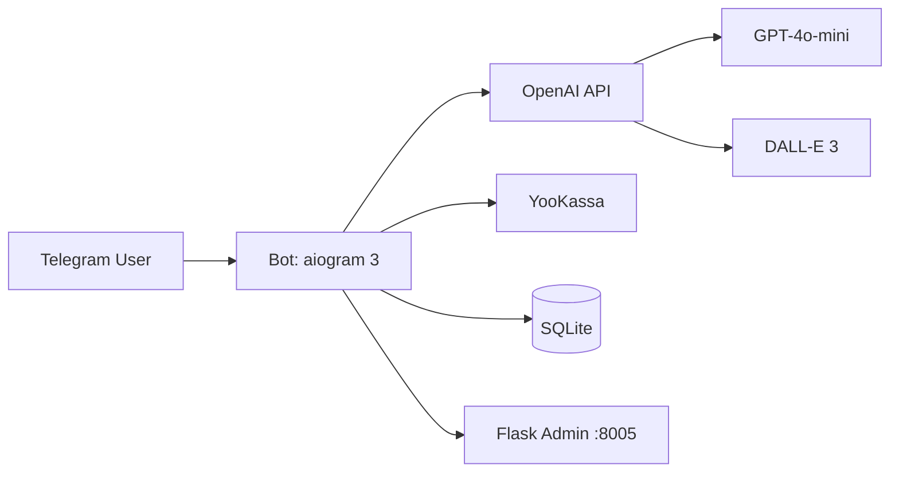

# Content Generator Bot

[]()
[]()
[]()
[]()

**AI-бот для генерации контента в Telegram с подпиской через YooKassa**

## О проекте

**Content Generator Bot** — это production-ready Telegram-бот, который генерирует тексты и изображения через AI, монетизируется через подписку и управляется через веб-админку.

**Ключевые преимущества:**
- ✅ **AI-генерация** — GPT-4o-mini для текстов, DALL-E 3 для картинок
- 💳 **Монетизация** — 3 бесплатные попытки, далее подписка через YooKassa
- 📊 **Админка** — статистика, управление пользователями, ручное начисление генераций
- 🐳 **Docker** — деплой одной командой
- 🔒 **Безопасность** — система лимитов, ban-check middleware

## ⚡ Quick Start

1. 📥 Клонируй репозиторий:
   ```bash
   git clone https://github.com/kartuznik/content-generator-bot.git
   cd content-generator-bot
   ```
2. ⚙️ Подготовь переменные окружения:
   ```bash
   cp .env.example .env
   ```
3. 🚀 Запусти сервисы:
   ```bash
   docker compose up --build -d
   ```
4. ✅ Проверь:
   - Веб-админка: `http://localhost:8005`
   - Бот: polling в контейнере `content-generator-bot`

## ✨ Возможности

- 🤖 **AI-генерация текстов** — GPT-4o-mini (быстро и дёшево) или GPT-4 (качественнее)
- 🎨 **Генерация изображений** — DALL-E 3, высокое качество
- 💳 **Подписка через YooKassa** — неделя (299₽) или месяц (799₽)
- 🎁 **3 бесплатные генерации** — для тестирования
- 📊 **Веб-админка** — статистика, управление пользователями, история генераций
- 🔒 **Система лимитов** — автоматический контроль использования
- 🐳 **Docker-деплой** — запуск одной командой
- 📝 **Управление промптами** — через таблицу `prompts` (расширяемо под задачи проекта)

## 🏗 Архитектура



**Компоненты:**
- **Bot** — Telegram polling, обработка команд
- **OpenAI** — генерация текстов и изображений
- **YooKassa** — приём платежей
- **SQLite** — хранение пользователей, генераций, подписок
- **Admin** — веб-интерфейс для управления

## 📱 Команды бота

| Команда | Описание | Доступ |
|---------|----------|--------|
| `/start` | Приветствие и запуск | Все пользователи |
| `/generate <текст>` | Генерация текста через GPT | Все (с лимитом) |
| `/generate_image <описание>` | Генерация изображения через DALL-E 3 | Все (с лимитом) |
| `/subscribe` | Оформить подписку | Все |
| `/help` | Справка по командам | Все |
| `/status` | Проверить остаток генераций | Все (если команда включена в текущем билде) |

## 🔧 Переменные окружения

| Переменная | Обязательна | Описание | Пример |
|------------|-------------|----------|--------|
| `TELEGRAM_BOT_TOKEN` | ✅ | Токен бота от @BotFather | `123456:ABC...` |
| `OPENAI_API_KEY` | ✅ | API ключ OpenAI | `sk-...` |
| `OPENAI_MODEL` | ❌ | Модель для текста | `gpt-4o-mini` |
| `YOKASSA_SHOP_ID` | ✅ | Shop ID ЮKassa | `123456` |
| `YOKASSA_SECRET_KEY` | ✅ | Secret Key ЮKassa | `test_...` |
| `YOOKASSA_RETURN_URL` | ✅ | URL возврата после оплаты | `https://t.me/bot` |
| `ADMIN_WEB_PASSWORD` | ✅ | Пароль админки | `Admin123!` |
| `FLASK_SECRET_KEY` | ✅ | Секрет Flask-сессий | `random-string` |
| `DB_PATH` | ❌ | Путь к SQLite БД | `data/content_generator.db` |
| `LOG_LEVEL` | ❌ | Уровень логирования | `INFO` |

**Создай `.env` файл:**
```bash
cp .env.example .env
nano .env  # заполни значения
```

## 📦 Установка

### Вариант 1: Docker (рекомендуется)

```bash
# 1. Клонируй репозиторий
git clone https://github.com/kartuznik/content-generator-bot.git
cd content-generator-bot

# 2. Настрой переменные окружения
cp .env.example .env
nano .env  # заполни ключи

# 3. Запусти
docker compose up -d --build

# 4. Проверь логи
docker compose logs -f bot
```

### Вариант 2: Локально (Python 3.12+)

```bash
# 1. Создай venv
python3 -m venv venv
source venv/bin/activate

# 2. Установи зависимости
pip install -r requirements.txt

# 3. Настрой .env
cp .env.example .env

# 4. Запусти бота
python -m bot.main

# 5. Запусти админку (в другом терминале)
python -m web.app
```

## 🚀 Деплой на сервер

### Требования:
- VPS с Ubuntu 22.04+
- 2 ядра, 4 GB RAM
- Docker + Docker Compose

### Шаги:

1. **Подключись к серверу:**
```bash
ssh root@your-server-ip
```

2. **Установи Docker:**
```bash
curl -fsSL https://get.docker.com | sh
```

3. **Запусти проект:**
```bash
git clone https://github.com/kartuznik/content-generator-bot.git
cd content-generator-bot
cp .env.example .env
nano .env  # заполни ключи
docker compose up -d
```

4. **Настрой автозапуск:**
```bash
docker compose up -d --restart unless-stopped
```

**Готово!** Бот и админка запущены, веб-панель доступна на порту `8005`.

## 📊 Мониторинг и админка

### Веб-админка

**URL:** `http://your-server-ip:8005`

**Возможности:**
- 📈 **Dashboard** — статистика пользователей, активных подписок, генераций
- 👥 **Users** — управление лимитами, ручное начисление генераций (+5)
- 📝 **Generations** — история последних 50 генераций

**Вход:** пароль из `ADMIN_WEB_PASSWORD`

### Логи

```bash
# Логи бота
docker compose logs -f bot

# Логи админки
docker compose logs -f web

# Последние 50 строк
docker compose logs --tail=50 bot
```

## 🔧 Решение проблем

| Проблема | Причина | Решение |
|----------|---------|---------|
| `401 Unauthorized` | Неверный API ключ | Проверь `OPENAI_API_KEY` в `.env` |
| `Connection refused` | Бот не запущен | `docker compose up -d` |
| `Port already in use` | Порт 8005 занят | Измени порт в `docker-compose.yml` |
| `No free generations` | Лимит исчерпан | `/subscribe` или админка → +5 генераций |
| `Database locked` | БД занята | Перезапусти бота: `docker compose restart bot` |

### Частые ошибки

**Ошибка:** `Error: TOKEN_INVALID`  
**Решение:** Проверь токен бота в @BotFather

**Ошибка:** `Error: CHAT_ID_NOT_FOUND`  
**Решение:** Пользователь не запустил бота через `/start`

## 👨‍💻 Разработка

### Структура проекта

```text
content-generator-bot/
├── bot/               # Telegram бот
│   ├── handlers/      # Хендлеры команд
│   ├── services/      # OpenAI, YooKassa клиенты
│   ├── middlewares/   # Middleware (лимиты, бан)
│   └── main.py        # Точка входа
├── web/               # Flask админка
│   ├── routes/        # Роуты админки
│   └── templates/     # HTML шаблоны
├── data/              # SQLite база данных
├── docker-compose.yml
└── .env.example
```

### Тестирование

```bash
# Smoke-тест
python3 test_smoke.py

# Запуск бота локально
python -m bot.main

# Запуск админки локально
python -m web.app
```

### Добавление новой команды

1. Создай файл `bot/handlers/new_command.py`
2. Зарегистрируй роутер в `bot/main.py`
3. Перезапусти бота

## ❓ FAQ

**Q: Сколько стоит генерация?**  
A: 3 бесплатные попытки, далее подписка 299₽/неделя или 799₽/месяц.

**Q: Можно ли сменить модель?**  
A: Да, измени `OPENAI_MODEL=gpt-4` в `.env` и перезапусти бота.

**Q: Как добавить генерации пользователю?**  
A: Админка → Users → найди пользователя → "Добавить +5 генераций".

**Q: Работает ли без интернета?**  
A: Нет, требуется доступ к OpenAI API.

## 📄 Лицензия

MIT License — используй как хочешь.

## 👤 Авторы

- [kartuznik](https://github.com/kartuznik)

## 🙏 Благодарности

- [aiogram 3](https://docs.aiogram.dev/) — Telegram framework
- [OpenAI](https://openai.com/) — GPT-4 и DALL-E 3 API
- [YooKassa](https://yookassa.ru/) — платёжная система
