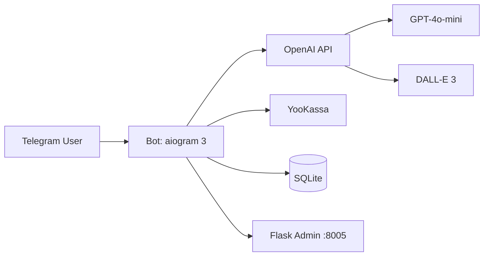

# Content Generator Bot

[](https://www.python.org/downloads/)
[](https://docs.aiogram.dev/)
[](https://docs.docker.com/compose/)
[](LICENSE)

**AI-бот для генерации текстов и изображений в Telegram с подпиской через YooKassa и Flask-админкой.**

| Паспорт | |
|---|---|
| **Уровень** | Level 1 — Simple bot (команды + лимиты + платежи, без LangGraph) |
| **Статус** | inactive — продукт заморожен как незавершённая наработка: заказ не состоялся, баланс OpenAI для DALL-E пуст; воскрешение по [docs/RUNBOOK.md](docs/RUNBOOK.md) при появлении заказа или средств |
| **Ценность** | Self-hosted генерация контента с пробным лимитом, подпиской и веб-админкой |
| **Актуализация README** | 2026-08-06 · см. [git history](https://github.com/kartuznik/content-generator-bot/commits/main) / сообщения коммитов |

Операции (deploy, backup, ротация ключей, инциденты): [docs/RUNBOOK.md](docs/RUNBOOK.md).

---

## О проекте

**Content Generator Bot** — portfolio / self-hosted MVP: Telegram-бот генерирует тексты и изображения через OpenAI, ограничивает бесплатные попытки, предлагает подписку через YooKassa и отдаёт статистику во Flask-админке.

### Что умеет

- Генерация текста (`/generate`) через настраиваемую модель OpenAI (по умолчанию `gpt-4o-mini`).
- Генерация изображений (`/generate_image`) через DALL-E 3.
- Пробный лимит бесплатных генераций, далее оформление подписки командой `/subscribe`.
- Веб-админка на порту **`:8005`**: dashboard, пользователи, история генераций, ручное начисление попыток.
- Middleware лимитов и ban-check; Docker Compose с `restart: unless-stopped`.

### Чего не умеет (честный scope)

- Не multi-tenant SaaS и не enterprise IAM (SSO/SAML).
- Нет multi-agent / LangGraph, нет RAG по базе знаний и нет встроенного веб-поиска.
- Нет полноценного Prometheus/Grafana-стека «из коробки» (логи через `docker compose logs`).
- Нет LLM-fallback на второго провайдера: при недоступности OpenAI генерация честно падает с сообщением пользователю.
- Конкретные цены подписки и коммерческие офферы **не** живут в этом репозитории.

### Коммерческая модель (без сумм)

1. Несколько **бесплатных пробных** генераций для знакомства с продуктом.
2. Далее — **подписка** через YooKassa на период **неделя** или **месяц** (оформление в боте: `/subscribe`).
3. Админ может вручную начислять генерации в веб-панели.

Конкретные цены, акции и договорённости — **вне git** (презентации, листинги, чат с владельцем).

### Поведение при сбоях (graceful degradation)

- **OpenAI недоступен / ошибка API:** бот пишет пользователю честное сообщение об ошибке генерации, сохраняет факт неуспеха в БД, **не** списывает успешную генерацию; предлагает повторить позже.
- **Лимит исчерпан:** middleware блокирует генерацию и направляет к `/subscribe` или к действию админа.
- **Пользователь в ban-list:** запросы отклоняются middleware.
- **Падение процесса:** сервисы `bot` и `web` в Compose с `restart: unless-stopped` поднимаются снова; детали — в [docs/RUNBOOK.md](docs/RUNBOOK.md).

---

## Быстрый старт

```bash
git clone https://github.com/kartuznik/content-generator-bot.git
cd content-generator-bot
cp .env.example .env   # заполните токены и ключи (имена — в таблице ниже)
docker compose up --build -d
docker compose logs -f bot
```

Проверка:

- Веб-админка: `http://localhost:8005` (пароль из `ADMIN_WEB_PASSWORD` в вашем `.env`)
- Бот: polling в контейнере `content-generator-bot`

---

## Возможности

### Для клиента (Telegram)

- `/start`, `/help`, `/status` — вход, справка, остаток генераций (если команда включена в текущем билде).
- `/generate <текст>` — текст через OpenAI.
- `/generate_image <описание>` — изображение через DALL-E 3.
- `/subscribe` — оформление подписки (неделя / месяц) через YooKassa.

### Для администратора (веб `:8005`)

- Dashboard: пользователи, активные подписки, объём генераций.
- Users: лимиты, ручное начисление генераций.
- Generations: история последних генераций.
- Вход: пароль из переменной `ADMIN_WEB_PASSWORD` (значение только в серверном `.env`).

---

## Архитектура



**Компоненты:** Bot (polling) · OpenAI (текст/картинки) · YooKassa (платежи) · SQLite · Flask Admin.

---

## Демо

Плейсхолдеры под скриншоты (файлы добавит владелец):

| Плейсхолдер | Сценарий |
|---|---|
| `docs/demo/01-generate-text.png` | `/generate` — ответ бота с текстом |
| `docs/demo/02-generate-image.png` | `/generate_image` — картинка в чате |
| `docs/demo/03-subscribe.png` | `/subscribe` — выбор периода подписки |
| `docs/demo/04-admin-dashboard.png` | Веб-админка: dashboard |
| `docs/demo/05-admin-users.png` | Веб-админка: начисление генераций |

Пока файлов нет — список сцен выше остаётся контрактом демо.

Живой демо-бот: ссылка на `@…` добавляется владельцем после публикации (не хардкодить чужой username).

---

## Команды бота

| Команда | Описание | Доступ |
|---------|----------|--------|
| `/start` | Приветствие и запуск | Все |
| `/generate <текст>` | Генерация текста через GPT | Все (с лимитом) |
| `/generate_image <описание>` | Генерация изображения через DALL-E 3 | Все (с лимитом) |
| `/subscribe` | Оформить подписку | Все |
| `/help` | Справка по командам | Все |
| `/status` | Остаток генераций | Все (если включено в билде) |

---

## Переменные окружения

| Переменная | Обязательна | Назначение |
|------------|-------------|------------|
| `TELEGRAM_BOT_TOKEN` | да | Токен бота от @BotFather |
| `OPENAI_API_KEY` | да | Ключ OpenAI (embeddings не используются) |
| `OPENAI_MODEL` | нет | Модель текста (дефолт в `.env.example`) |
| `YOKASSA_SHOP_ID` | да | Shop ID ЮKassa |
| `YOKASSA_SECRET_KEY` | да | Secret Key ЮKassa |
| `YOOKASSA_RETURN_URL` | да | URL возврата после оплаты (обычно `https://t.me/<bot>`) |
| `ADMIN_WEB_PASSWORD` | да | Пароль входа в веб-админку |
| `FLASK_SECRET_KEY` | да | Секрет Flask-сессий |
| `DB_PATH` | нет | Путь к SQLite |
| `LOG_LEVEL` | нет | Уровень логирования |

```bash
cp .env.example .env
# заполните значения локально; не коммитьте .env
```

---

## Установка и деплой

### Docker Compose (рекомендуется)

```bash
git clone https://github.com/kartuznik/content-generator-bot.git
cd content-generator-bot
cp .env.example .env
docker compose up -d --build
docker compose logs -f bot
```

### Локально (Python 3.12+)

```bash
python3 -m venv venv
source venv/bin/activate
pip install -r requirements.txt
cp .env.example .env
python -m bot.main          # терминал 1
python -m web.app           # терминал 2 — админка
```

Подробный deploy, **backup/restore**, ротация ключей и инциденты — в [docs/RUNBOOK.md](docs/RUNBOOK.md).

Кратко backup: остановить writers → скопировать `./data/*.db` → запустить снова (см. runbook).

---

## Мониторинг и админка

| Роль | Порт / доступ |
|---|---|
| Flask admin | `:8005` (compose: хост `8005` → контейнер `5000`) |
| Логи bot/web | `docker compose logs -f bot` / `web` |

Вход в админку — пароль из `ADMIN_WEB_PASSWORD` вашего `.env`.

---

## Решение проблем

| Симптом | Что проверить |
|---------|----------------|
| `401` / ошибка OpenAI | `OPENAI_API_KEY`, баланс провайдера |
| `Connection refused` | `docker compose ps`, `docker compose up -d` |
| Port already in use | занят `:8005` — сменить mapping в `docker-compose.yml` |
| Нет бесплатных генераций | `/subscribe` или Users в админке |
| `Database locked` | `docker compose restart bot` |

---

## FAQ

**Q: Сколько стоит подписка?**  
A: В репозитории сумм нет. В продукте — пробные генерации, затем подписка на **неделю** или **месяц**; актуальные условия — вне git у владельца.

**Q: Это production-ready enterprise?**  
A: Нет. Это **portfolio / self-hosted MVP**.

**Q: Можно ли сменить модель текста?**  
A: Да — `OPENAI_MODEL` в `.env`, затем recreate сервисов (`docker compose up -d --build`).

**Q: Как добавить генерации пользователю?**  
A: Админка → Users → начисление генераций.

**Q: Работает ли без интернета / без OpenAI?**  
A: Нет. Без OpenAI генерация недоступна; бот сообщает об ошибке и не притворяется, что контент создан.

---

## Структура репозитория

```text
content-generator-bot/
├── bot/                 # Telegram-бот (handlers, services, middlewares)
├── web/                 # Flask-админка
├── data/                # SQLite (volume)
├── docs/                # RUNBOOK + demo placeholders
├── docker-compose.yml
├── LICENSE
└── .env.example
```

### Smoke / локальный прогон

```bash
python3 test_smoke.py
```

---

## Лицензирование и коммерческое использование

Базовая лицензия репозитория — **MIT** (см. [LICENSE](LICENSE)): код можно изучать, форкать и запускать self-hosted.

Коммерческие условия и редакции **Starter**, **Team** и **Custom** доступны **по запросу через контакт** (условия и коммерческие материалы — вне этого репозитория).

| Редакция | Состав (ориентир) |
|---|---|
| **Community (MIT)** | Self-host бот + Flask admin, OpenAI-генерация, лимиты, YooKassa-подписка по периодам |
| **Starter** | Community + сопровождение внедрения single-tenant demo |
| **Team** | Starter + расширенные ops (runbook, усиленный мониторинг/алерты по договорённости) |
| **Custom** | Индивидуальный scope: другие провайдеры LLM, биллинг, tenancy — обсуждается отдельно |

Конкретные цены и офферы живут **вне** git.

## License

MIT — см. [LICENSE](LICENSE).

## Авторы

- [kartuznik](https://github.com/kartuznik)
